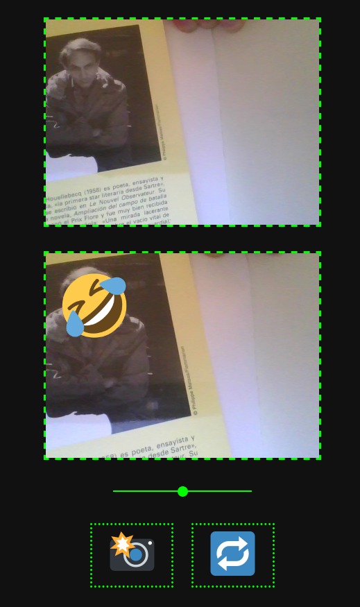

# emoji_face

Yes, put your face (or many faces from random people) take a photo 📸 and request for the emojis 🔁. Use the slider to set the emoji size.

It uses PoseNet model multipose (or singlepose -why not-) from [ML5.js](https://ml5js.org/)

Enjoy!

PD: the code is in spanish.

